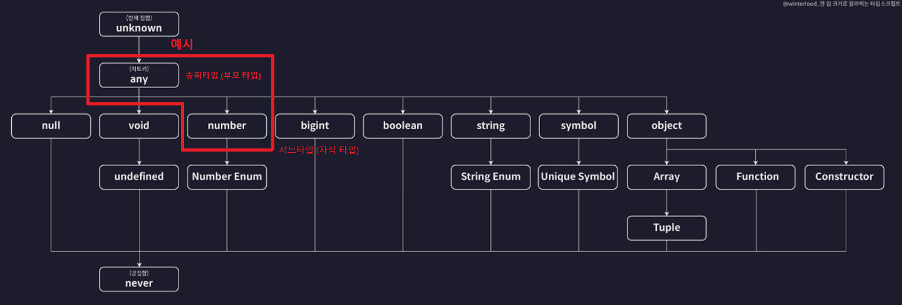

## 타입은 집합이다
- 부모타입으로 선언된 변수에 자식타입으로 선언된 변수를 넣을 수 있음
  <br>(부모타입 ⊃ 자식타입)
  

  ```typescript
  let anyVar: any = ""; // 슈퍼타입 (부모타입)
  let numVar: number = 10; // 서브타입 (자식타입)

  anyVar = numVar; // 슈퍼타입 ⊃ 서브타입
  ```

## 타입 호환성
- 어떤 타입을 다른 타입으로 취급해도 괜찮은지 판단하는 것
- Up Cast
  - 서브타입 -> 슈퍼타입
  - 모든 상황에 가능
- Down Cast
  - 슈퍼타입 -> 서브타입
  - 대부분의 상황에서 불가능

## 객체타입의 호환성
- 어떤 객체타입을 다른 객체타입으로 취급해도 괜찮은지 판단하는 것
- 소스코드 예시

  ```typescript
  type Animal = {
    name: string;
    color: string;
  }

  type Dog = {
    name: string;
    color: string;
    breed: string;
  }

  let animal: Animal = {
    name: "기린",
    color: "yellow",
  }

  let dog: Dog = {
    name: "설탕",
    color: "white",
    breed: "비숑",
  }

  animal = dog;
  dog = animal; // 에러 발생 (초과 프로퍼티 검사)
  ```

## 대수타입
- 여러개의 타입을 합성해서 새롭게 만들어낸 타입
- 합집합 타입 (Union 타입)

  ```typescript
  let a: string | number;
  a = 1;
  a = "hello";

  let arr: (number | string | boolean)[] = [1, "hello", true];

  type Person = {
    name: string;
    language: string;
  }
  type Animal = {
    name: string;
    color: string;
  }
  type Union1 = Person | Animal;
  let union1 = {
    name: "",
    language: "",
  }
  let union2 = {
    name: "",
    color: "",
  }
  let union3 = {
    name: "",
    language: "",
    color: "",
  }
  ```

- 교집합 타입 (Intersection 타입)
  
  ```typescript
  let variable: number & string; // -> never 타입 (불가능)

  type Person = {
    name: string;
    language: string;
  }
  type Animal = {
    name: string;
    color: string;
  }
  type Intersection = Person & Animal;
  let intersection1: Intersection = {
    name: "",
    language: "",
    color: "",
  }
  ```

## 타입 추론
- 변수의 타입을 자동으로 추론하는 기능
- 암묵적 타입만 추론을 하여 타입을 진화시킴

  ```typescript
  let a; // 암묵적 any 타입
  a = 10; // any -> number (진화)
  a.toFixed();

  a = "hello"; // -> string (진화)
  a.toUpperCase();
  a.toFixed(); // 에러 발생
  ```

- 타입을 범용적으로 사용할 수 있도록 하는 것, 타입을 추론하는 과정 -> **타입 넓히기**

## 타입 단언 (Type Assertion)
- 타입 단언의 규칙
  - 값 as 단언 : 단언식
  - A as B
    - A는 B의 슈퍼타입이거나 서브타입이어야 함

```typescript
type Person = {
  name: string;
  age: number;
}

let person1 = {} as Person; // 타입 단언
person1.name = "owen";
person1.age = 30;

let person2 = {
  name: "owen",
  age: 30,
  hobby: "game",
} as Person; // 타입 단언 (A는 B의 서브타입)

let person3 = {
  name: "owen",
} as Person; // 타입 단언 (A는 B의 슈퍼타입)
```

- const 단언
  
  ```typescript
  let cat = {
    name: "고양이",
    color: "yello",
  } as const;

  cat.name = ""; // 에러 발생 (const로 단언되면 변경할 수 없음)
  ```

- Non Null 단언
  
  ```typescript
  type Post = {
    title: string;
    author?: string;
  };

  let post: Post = {
    title: "게시글1",
    author: "owen",
  };

  const len1: number = post.author?.length; // 에러 발생

  const len2: number = post.author!.length; // ! : 타입스크립트에게 null, undefined가 아니라고 말해주는 것
  ```

## 타입 좁히기
- 조건문 등을 이용해 넓은 타입에서 좁은 타입으로 좁힘

- 소스코드 예시 #1

  ```typescript
  function func(value: number | string | Date | null) {
    if (typeof value === "number") {
      console.log(value.toFixed());
    } else if (typeof value === "string") {
      console.log(value.toUpperCase());
    } else if (typeof value === "object") {
      console.log(value.getTime()); // value가 null일 수도 있기 때문에 에러 발생함
    }
  }
  ```

- 소스코드 예시 #2

  ```typescript
  function func(value: number | string | Date | null) {
    if (typeof value === "number") {
      console.log(value.toFixed());
    } else if (typeof value === "string") {
      console.log(value.toUpperCase());
    } else if (value instanceof Date) {
      console.log(value.getTime()); // Date로 타입을 좁혔기 때문에 에러 발생하지 않음
    }
  }
  ```

- 소스코드 예시 #3

  ```typescript
  type Person = {
    name: string;
    age: number;
  }

  function func(value: number | string | Date | null | Person) {
    if (typeof value === "number") {
      console.log(value.toFixed());
    } else if (typeof value === "string") {
      console.log(value.toUpperCase());
    } else if (value instanceof Date) {
      console.log(value.getTime());
    } else if (value && "age" in value) {
      console.log(`${value.name}은 ${value.age}살 입니다.`);
    } // 객체는 null이 아닌지 체크하고 객체 안에 무슨 값이 존재하는지에 대한 판단으로 타입을 좁힐 수 있음
  }
  ```

## 서로소 유니온 타입
- 교집합이 없는 타입들로 만든 유니온 타입
- 소스코드 예시

  ```typescript
  type LoadingTask = {
    state: "LOADING";
  };

  type FailedTask = {
    state: "FAILED";
    error?: {
      message: string;
    };
  };

  type SuccessTask = {
    state: "SUCCESS";
    response?: {
      data: string;
    };
  };

  type AsyncTask = LoadingTask | FailedTask | SuccessTask;

  function processResult(task: AsyncTask) {
    switch (task.state) {
      case "LOADING": {
        console.log("로딩 중");
        break;
      }
      case "FAILED": {
        console.log(`에러 발생 : ${task.error.message}`);
        break;
      }
      case "SUCCESS": {
        console.log(`성공 : ${task.response.data}`);
        break;
      }
    }
  }

  const loading: LoadingTask = {
    state: "LOADING",
  }

  const failed: FailedTask = {
    state: "FAILED",
    error: {
      message: "오류 발생 원인은 ~",
    },
  };

  const success: SuccessTask = {
    state: "SUCCESS",
    response: {
      data: "데이터 ~",
    },
  };
  ```