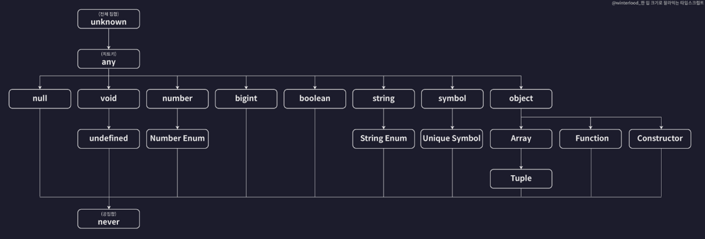

## 기본 타입?
- 타입스크립트가 자체적으로 제공하는 타입 (내장 타입)
  

## 원시 타입 (Primitive Type)
- 하나의 값만 저장하는 타입
  - number
  - string
  - boolean
  - null
  - undefined
- 소스코드

  ```javascript
  // number
  let num1: number = 123;
  let num2: number = -123;
  let num3: number = 0.123;
  let num4: number = -0.123;
  let num5: number = Infinity;
  let num6: number = -Infinity;
  let num7: number = NaN; // Not a Number

  // string
  let str1: string = "hello";
  let str2: string = `hello ${num1}`;

  // boolean
  let bool1: boolean = true;
  let bool2: boolean = false;

  // null
  let null1: null = null;

  // undefined
  let unde1: undefined = undefined;

  // 리터럴 타입
  // 리터럴 -> 값
  let numA: 10 = 10;
  numA = 12; // 오류 발생
  ```

## 배열 타입
```javascript
// 배열
let numArr: number[] = [1, 2, 3];
let strArr: string[] = ["hello", "im", "owen"];
let boolArr: Array<boolean> = [true, false, true]; // 제네릭 문법으로도 타입을 지정할 수 있음

// 배열에 들어가는 요소들의 타입이 다양할 경우
let multiArr: (number | string)[] = [1, "hello"]; // 유니온 타입

// 다차원 배열의 타입을 정의하는 방법
let doubleArr: number[][] = [
  [1, 2, 3],
  [4, 5],
];
```

## 튜플 타입
- 튜플 : 길이와 타입이 고정된 배열
- 소스코드

  ```typescript
  let tup1: [number, number] = [1, 2];
  let tup2: [number, string, boolean] = [1, "2", true];

  // 배열 메서드를 사용해서 배열 길이를 변경하여도 에러가 발생하진 않음
  tup1.push(1);
  tup1.pop();
  tup1.pop();
  ```

- 튜플은 언제 사용할까?

  ```typescript
  const users: [string, number][] = [
    ["park", 1],
    ["kim", 2],
    ["choi", 3],
    ["cha", 4],
    [5, "owen"], // 에러 발생 (배열을 사용할 때 인덱스의 위치에 따라서 넣어야 되는 값들이 이미 정해져 있고 그 순서를 지키는게 중요할 때 유용함)
  ];
  ```

## 객체 타입
```typescript
// object
let user: {
  id?: number; // Optional 프로퍼티 : 해당 프로퍼티가 있어도 되고 없어도 됨
  name: string;
} = {
  id: 1,
  name: "owen",
};

user = {
  name: "kim",
};

let config: {
  readonly apiKey: string; // 수정 불가
} = {
  apiKey: "My Api Key",
};

config.apiKey = "hacked"; // 에러 발생
```

## 타입 별칭
```typescript
type User = {
  id: number;
  name: string;
  birth: string;
};

let user: User = {
  id: 1,
  name: "owen",
  birth: "2025.01.28",
};
```

## 인덱스 시그니처
- 키와 밸류의 타입을 기준으로 규칙을 이용해서 유연하게 객체의 타입을 정의하는 문법

  ```typescript
  type CountryCodes = {
    [key: string]: string; // 위반만 하지 않으면 됨 -> 빈 객체로 선언해도 위반을 하진 않았기 떄문에 빈 객체도 넣을 수 있음
    Korea: string; // Korea라는 key는 무조건 할당되어야 함

  };

  let countryCodes1: CountryCodes = {
    Korea: "ko",
    UnitedState: "us",
    UnitedKingdom: "uk",
  };

  let countryCodes2: CountryCodes = {}; // 에러 발생 (Korea key가 없음)

  let countryCodes3: CountryCodes = {
    Korea: "ko",
  };
  ```

## enum 타입
- 여러가지 값들에 각각 이름을 부여해 열거해두고 사용하는 타입
- 소스코드

  ```typescript
  enum Role {
    ADMIN = 0,
    USER = 1,
    GUEST = 2,
  }

  enum Language {
    KOREAN = "ko",
    ENGLISH = "us",
  }

  const user1 = {
    name: "kim",
    role: Role.ADMIN,
    language: Language.KOREAN,
  }

  const user2 = {
    name: "park",
    role: Role.USER,
    language: Language.ENGLISH,
  };
  ```

## any 타입
- 특정 변수의 타입을 확실히 모를때
- 소스코드

  ```typescript
  let anyVar: any = 10;
  anyVar = "hello";
  anyVar = {};
  anyVar = () => {};

  anyVar.toUpperCase(); // 현재는 string이 아니기 때문에 런타임 에러가 발생함

  let num: number = 10;
  num = anyVar;
  ```

## unknown 타입
- any 타입과는 다르게 안되는 경우가 있음
- 소스코드
  
  ```typescript
  let unknownVar: unknown;
  unknownVar = "";
  unknownVar = 1;

  let num: number = unknown; // 에러 발생
  unknownVar.toUpperCase(); // 에러 발생
  ```

## void 타입
- 아무것도 없음을 의미하는 타입
- 소스코드

  ```typescript
  function func1(): string {
    return "hello";
  }

  function func2(): void {
    console.log("hello");
  }

  let a: void;
  a = 1; // 에러 발생
  a = "hello"; // 에러 발생
  a = undefined; // undefined만 할당 가능
  ```

## never 타입
- 불가능한 타입
- 종료할 수가 없어서 함수에 반환값이 있는 거 자체가 모순이다 라고 하는 경우
- 소스코드
  
  ```typescript
  function func3(): never {
    while (true) {}
  }

  function func4(): never {
    throw new Error();
  }

  // 어떠한 값도 담을 수 없음
  let a: never;
  a = 1; // 에러 발생
  a = {}; // 에러 발생
  a = undefined; // 에러 발생
  a = anyVar; // 에러 발생
  ```